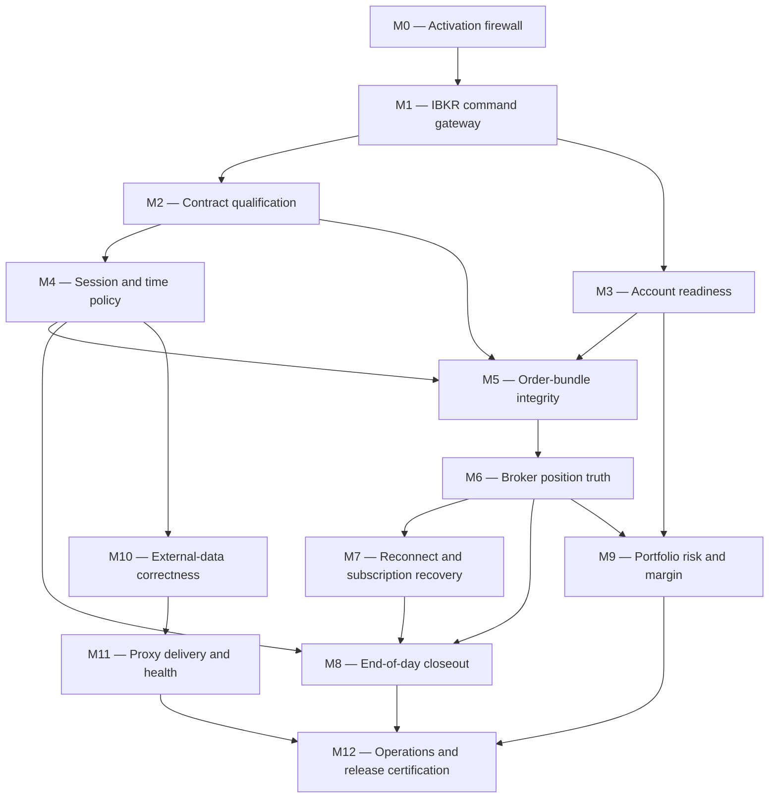

This plan contains 13 dependency-ordered milestones, each intended to be implemented, tested, reviewed, and committed separately. [ANSWERS.md](/D:/dev/quant/ANSWERS.md) is the approved policy source for the numerical and operational decisions incorporated below. `JavaClient` remains strictly out of scope.

## Severity

- **P0 — LIVE blocker:** Could send unintended orders, leave an unprotected or overnight position, use the wrong account/security, or exceed approved risk.
- **P1 — Reliability blocker:** Could disrupt recovery, consume stale data, or make unattended operation unsafe.
- **P2 — Maintainability/operations:** Increases operational or architectural risk but does not directly create a position.

## Non-negotiable safety invariants

Every milestone must preserve these:

1. PAPER-only strategies can never submit to LIVE, regardless of configuration mistakes.
2. No entry is submitted without the expected account, a qualified contract, valid session, coherent account state, successful reconciliation, and approved risk.
3. IBKR positions and executions are authoritative; a local bracket is intent, not proof of position state.
4. A trade is never considered protected until every required protective leg is broker-acknowledged.
5. A trade is never considered flat until IBKR confirms a zero position and no relevant working order can reopen it.
6. Ambiguous callbacks, order errors, disconnects, stale data, or unknown state close the entry gate.
7. `MANUAL_INTERVENTION` remains sticky until process restart and clean reconciliation.
8. Every outbound IBKR request passes through one paced, observable gateway.
9. All order callbacks remain idempotent because IBKR may duplicate them.
10. No engine-owned position may intentionally survive the session. Failure to confirm engine flatness and resolution of relevant engine orders becomes an externally alerted emergency; unmanaged/manual positions are preserved.
11. PAPER and LIVE use distinct accounts, client IDs, state files, logs, proxy credentials, and deployment configuration.
12. Intent remains durably recorded before transmission.
13. LIVE order submission is disarmed after every process start until explicitly confirmed in the UI; arming is never restored from configuration, a journal, or a previous run.

## Dependency order

## Documentation sets

Each milestone updates code and its documentation together.

- **D1:** [Trading-engine README](/D:/dev/quant/trading-engine/trading-engine/README.md)
- **D2:** [Application structure](/D:/dev/quant/.claude/rules/structural-documentation/trading-engine-app.md), [configuration](/D:/dev/quant/.claude/rules/structural-documentation/trading-engine-config.md), [startup flow](/D:/dev/quant/.claude/rules/feature-based-workflows/trading-engine-startup-flow.md)
- **D3:** [IBKR structure](/D:/dev/quant/.claude/rules/structural-documentation/trading-engine-broker-ibkr.md), [callbacks](/D:/dev/quant/.claude/rules/structural-documentation/trading-engine-broker-ibkr-callback.md), [concurrency](/D:/dev/quant/.claude/rules/concurrency-and-execution-boundaries/trading-engine-concurrency.md), [market-data flow](/D:/dev/quant/.claude/rules/feature-based-workflows/trading-engine-market-data-flow.md)
- **D4:** [Account and margin flow](/D:/dev/quant/.claude/rules/feature-based-workflows/trading-engine-account-and-margin-flow.md), [reconciliation and risk](/D:/dev/quant/.claude/rules/structural-documentation/trading-engine-reconciliation-risk.md), [broker reconciliation](/D:/dev/quant/.claude/rules/feature-based-workflows/trading-engine-broker-reconciliation-flow.md)
- **D5:** [Execution structure](/D:/dev/quant/.claude/rules/structural-documentation/trading-engine-execution.md), [order execution flow](/D:/dev/quant/.claude/rules/feature-based-workflows/trading-engine-order-execution-flow.md), [position management](/D:/dev/quant/.claude/rules/feature-based-workflows/trading-engine-position-management-flow.md), [state machines](/D:/dev/quant/.claude/rules/state-machine/trading-engine-state-machines.md)
- **D6:** [Calendar structure](/D:/dev/quant/.claude/rules/structural-documentation/trading-engine-calendar.md), [strategy structure](/D:/dev/quant/.claude/rules/structural-documentation/trading-engine-strategy.md)
- **D7:** [Earnings structure](/D:/dev/quant/.claude/rules/structural-documentation/trading-engine-earnings.md), [proxy transport](/D:/dev/quant/.claude/rules/structural-documentation/options-proxy-app-transport.md), [proxy concurrency](/D:/dev/quant/.claude/rules/concurrency-and-execution-boundaries/options-proxy-concurrency.md), [options-proxy README](/D:/dev/quant/options-proxy/README.md)
- **D8:** [IBKR documentation snapshot](/D:/dev/quant/IBKR_TWS_API_DOCUMENTATION.md) and the operating/PAPER/LIVE sections of D1.

# Milestones

## M0 — Strategy activation and deployment firewall

**Status:** Implemented in the current worktree with automated tests passing; controlled PAPER verification remains pending before M0 is certified complete and M1 begins.

**Findings:** PAPER verification strategies start in LIVE; an empty universe throws despite documentation saying it disables a strategy; LIVE permits a blank expected account.

**Severity/failure:** P0. A permissive PAPER strategy could trade real capital, or an operator may be unable to disable it safely.

**Required behavior:**

- Add explicit strategy activation metadata: identifier, permitted modes, enabled flag, universe.
- Mark both one-sigma strategies permanently `PAPER_ONLY`.
- Reject startup if a PAPER-only strategy is enabled in LIVE.
- Disabled strategies are not constructed and may have an empty universe.
- Enabled strategies require a nonempty universe.
- Require `IBKR_EXPECTED_ACCOUNT` in LIVE.
- Log an immutable startup manifest naming mode, account, client ID, enabled strategies, state file, and log file.
- Keep the current implementation and verification phase PAPER-only.
- For the future LIVE deployment, start disarmed on every process start and require an explicit, volatile UI confirmation before LIVE order submission is possible.
- Support future simultaneous PAPER and LIVE sessions on the same Windows host only through distinct accounts, endpoints/ports, client IDs, journals/state, logs, proxy receiver configuration/credentials, and independent LIVE arming. The exact process topology is deferred until that deployment is built.

**Components:** `Main`, `Config`, `EnvPropConfig`, strategy construction, `AbstractStrategy`.

**Minimal changes:** Introduce a small `StrategyDefinition`/`StrategyActivationPolicy`; avoid changing strategy algorithms.

**Automated tests:**

- Every LIVE/PAPER strategy-and-configuration combination.
- PAPER-only strategy rejected in LIVE.
- Disabled empty-universe strategy succeeds.
- Enabled empty-universe strategy fails.
- LIVE with blank expected account fails.
- Startup manifest contains no ambiguity between PAPER and LIVE.
- LIVE starts disarmed, prior-run arming cannot be restored, and PAPER arming cannot arm LIVE.

**PAPER verification:** Start with each strategy individually enabled and disabled; confirm only intended threads exist and every order reaches the PAPER account.

**Documentation:** D1, D2, D6.

**Dependencies:** None.

**Rollback:** Revert the milestone while remaining PAPER-only. Never restore the present configuration path in LIVE.

---

## M1 — Central IBKR command gateway and pacing

**Findings:** Direct `EClientSocket` calls are distributed across execution, reconciliation, session, and market-data code; the live-data loop can burst at approximately 100 requests/second; error 100 is not operationally handled.

**Severity/failure:** P1, escalating to P0 if order/control requests are delayed behind market-data bursts.

**Required behavior:**

- Every outbound request except socket connect/disconnect passes through one gateway.
- Default rate remains below IBKR’s documented 50 requests/second, with configurable headroom.
- Orders, cancels, closeout, and reconciliation have priority over background history.
- Rate limiting uses a clock/scheduler, not scattered `Thread.sleep` calls.
- Queue depth, age, request type, rejection, and error 100 are observable.
- No retry may duplicate an order unless broker state proves the first attempt did not arrive.

**Components:** New `IbkrCommandGateway` and pacer; `MarketDataSubscriptionManager`, `TickByTickManager`, `ReconciliationManager`, `BracketOrderExecutor`, `IbkrSessionManager`.

**Minimal changes:** Preserve existing request construction; replace only the actual send calls.

**Automated tests:**

- Deterministic fake-clock rate tests.
- No more than the configured rate in one-second windows.
- Priority ordering under a saturated queue.
- Cancellation and shutdown behavior.
- Error-100 escalation.
- No order duplication during timeout or retry.

**PAPER verification:** Initialize the full universe while recording TWS API logs; confirm no pacing errors and that an emergency control request is not delayed by history requests.

**Documentation:** D1, D3, D5.

**Dependencies:** M0.

**Rollback:** Retain a legacy direct-send switch for PAPER during validation only. LIVE must refuse to run if the gateway is bypassed.

---

## M2 — Contract qualification and immutable instrument identity

**Findings:** Contracts are currently created as `symbol/STK/SMART/USD`; no `reqContractDetails` qualification occurs; reconciliation treats missing `conId` as acceptable.

**Severity/failure:** P0. Orders or data may resolve ambiguously or refer to a different listing than the journal expects.

**Required behavior:**

- Qualify every traded and reference symbol before subscriptions or strategies start.
- Require exactly one matching stock contract.
- Persist and reuse `conId`, symbol, local symbol, primary exchange, currency, security type, trading class, minimum tick, exchange timezone, and liquid/trading hours.
- Market data and orders use the same immutable qualified contract.
- Missing, ambiguous, or changed qualification closes the gate.
- Reconciliation requires matching positive contract IDs rather than comparing only when both happen to be present.

**Components:** New `QualifiedContractCatalog` and `ContractDetailsHandler`; wrapper, subscription manager, `Stock`, executor, broker state, reconciliation, journal.

**Automated tests:**

- No match, one match, and multiple-match callbacks.
- Wrong security type/currency/primary exchange.
- Duplicate callback handling.
- Qualification timeout.
- Contract change across restart.
- Reconciliation with absent or mismatched `conId`.

**PAPER verification:** Compare every qualified contract against TWS Contract Details; place small test orders only after conIDs and primary exchanges match.

**Documentation:** D1, D2, D3, D4.

**Dependencies:** M1.

**Rollback:** Unqualified contracts may be temporarily restored in PAPER only. LIVE remains disabled.

---

## M3 — Atomic account snapshots and account readiness

**Findings:** `accountReady=false` is silently discarded; account fields are individually mutable; `accountDownloadEnd` is ignored; the first managed account can differ from the configured account; local receipt time is treated as account freshness; account updates may take three minutes.

**Severity/failure:** P0. Incorrect reset-period balances could size a margin-enabled entry.

**Required behavior:**

- Replace independently authoritative account fields with an immutable `AccountSnapshot`.
- Track expected account, `accountReady`, initial-download completion, update generation, broker timestamp/raw timestamp, local receipt time, required tags, and validity.
- `accountReady=false`, disconnect, account mismatch, or reset invalidates readiness immediately.
- Initial readiness requires the selected account, `accountReady=true`, all required tags, and `accountDownloadEnd`.
- Subsequent snapshots are committed only at a validated update boundary.
- No entry uses a mixed-generation account snapshot.
- The documented three-minute cadence is an accepted latency, not bypassed with stale data.
- UI and risk code read one snapshot.

**Components:** `Account`, `AccountEventHandler`, `EWrapperRaptor`, `IbkrSessionManager`, `Blackboard`, strategy admission.

**Automated tests:**

- Callback recordings covering `accountReady=true/false`.
- Values following `accountReady=false` are unusable.
- Wrong-account callbacks are rejected.
- `accountDownloadEnd` before/after required tags.
- Disconnect/reconnect invalidation.
- Snapshot generation and concurrent reads.
- Account snapshot after an entry may remain stale for three minutes without permitting another entry.

**PAPER verification:** Capture real callback ordering at startup, after a fill, after cancellation, and through a reset. Compare every accepted field with TWS.

**Documentation:** D1 account-freshness section, D2, D3, D4.

**Dependencies:** M0 and M1.

**Rollback:** If callback behavior differs from tests, readiness remains false and trading stays blocked. Never fall back to the existing optimistic freshness behavior in LIVE.

---

## M4 — Session authority, market-open gate, and time normalization

**Findings:** Strategies gate only against the close; `opensAt` is not required; GAT is formatted in New York time without a timezone; validation uses another local-time interpretation; clock skew is not bounded.

**Severity/failure:** P0. An order could enter before the session, execute at an unintended time, or miss its time exit.

**Required behavior:**

- Introduce one `SessionPolicy` consumed by every strategy and closeout component.
- Require `opensAt`, `closesAt`, current trading date, and valid session status.
- Permit entries only when `opensAt <= now < emergencyCloseoutStart`, while the strategy's own entry rules permit entry. `SessionPolicy` must not introduce a global normal-entry cutoff that replaces strategy policy.
- Cross-check proxy hours against IBKR contract liquid hours; disagreement closes the gate.
- Record broker clock skew and impose a maximum permitted skew.
- Represent all application times as `Instant`.
- Submit GAT with an explicit IBKR-supported timezone or UTC representation.
- Compare normalized instants, never raw formatted strings.
- Set `DAY` and regular-session behavior explicitly on every order.

**Components:** `MarketSession`, `MarketCalendarClient`, `MarketCalendarStore`, `BrokerTimeHandler`, contract catalog, strategies, bracket executor/order.

**Automated tests:**

- Before open, at open, normal close, early close, holiday, and after close.
- DST transition dates.
- Missing/open-after-close timestamps.
- Proxy/IBKR schedule disagreement.
- Clock skew boundary.
- GAT round-trip in multiple JVM and TWS operator timezones.

**PAPER verification:** Test one normal session and one simulated early close; verify submitted GAT in TWS exactly matches the intended instant.

**Documentation:** D1, D3, D5, D6.

**Dependencies:** M2.

**Rollback:** A time-source disagreement must block entries. Revert only while flat and PAPER-only.

---

## M5 — Bracket submission integrity and order-error policy

**Findings:** Bracket legs are sent back-to-back; IBKR documents missing-parent error 10006; protective-leg, OCA, and GAT errors can become warnings; the parent can be considered working before all protection is acknowledged; precautionary warnings may require manual action.

**Severity/failure:** P0. A filled position could be missing a stop, target, or time exit.

**Required behavior:**

- Introduce an `OrderBundleSubmitter` with explicit acknowledgement stages.
- Submit the untransmitted parent and require acknowledgement before dependent legs, then transmit only through the final child.
- Require all intended legs to be acknowledged before declaring the bundle protected.
- Keep the entry serialization lock until bundle disposition is known.
- Classify errors by order role and state, not only by a short numeric list.
- Errors 10006, 107, 111, 338, 395, 10324–10327 and any unknown protective-leg rejection trigger halt and reconciliation.
- Maintain an allowlist of genuinely informational messages.
- Persist advanced rejection details and leg-level acknowledgement/rejection state.
- Duplicate callbacks remain harmless.
- Warnings requiring TWS interaction cannot leave an order classified as safely working.

**Components:** command gateway, `BracketOrderExecutor`, `BracketOrder`, `OrderLifecycleHandler`, `OrderRegistry`, state store, reconciliation.

**Automated tests:**

- Parent acknowledged before children.
- Parent-ack timeout.
- Failure before and after final transmit.
- Every documented protective error.
- Unknown error on parent versus protective child.
- Duplicate and reordered `openOrder`, `orderStatus`, and execution callbacks.
- Partial parent fills during submission.
- Restart while untransmitted orders existed.

**PAPER verification:** Force rejection, invalid GAT, invalid OCA, disconnect during each bundle stage, and TWS precaution warnings. Inspect every surviving position for complete protection.

**Documentation:** D1, D3, D5, D8.

**Dependencies:** M1–M4.

**Rollback:** Validate only while flat. On failure, cancel confirmed untransmitted orders, reconcile, and revert. Never revert with an unresolved broker order.

---

## M6 — Broker-position truth and recovery reconciliation

**Findings:** `Stock.positionState` derives position state from the local bracket and ownership, not `positionSize`; terminal exit callbacks can release ownership before broker-confirmed flatness; reconciliation does not fully compare side, position quantity, and exit coverage; open-order retrieval has client-binding limitations.

**Severity/failure:** P0. The engine may believe it is flat while holding stock, or treat an incompletely protected quantity as safe.

**Required behavior:**

- Introduce one authoritative broker-position store keyed by account and qualified `conId`.
- A nonzero broker position can never derive `FLAT`.
- Local bracket state represents intent and observed order state only.
- Position lifecycle requires agreement among executions, position callbacks, working exits, and the journal.
- Working protective quantity must cover the broker-confirmed absolute position.
- Unexpected position, side, account, contract, quantity, owner client, or missing protection triggers manual intervention.
- Completion requires broker-confirmed zero plus no order capable of reopening or flipping the position.
- Reconciliation remains read-only unless a separately approved closeout policy is active.
- Persist `permId`, `orderRef`, client ID, account, and conID sufficiently for crash recovery.
- Any state-schema extension remains backward-readable and backup-protected.

**Components:** `Stock`, `Blackboard`, `BrokerState`, `ReconciliationManager`, lifecycle handler, state store, order registry.

**Automated tests:**

- Local terminal state with nonzero broker position.
- Position quantity greater or smaller than working exits.
- Wrong side/account/conID.
- Fill while cancellation is pending.
- Duplicate execution and position callbacks.
- Crash/restart with parent working, partial fill, full position, completed exits, or orphan exit.
- Orders belonging to another client/TWS username.

**PAPER verification:** Restart the engine at every lifecycle stage and compare TWS, journal, broker snapshot, and derived state. No automated repair during these tests.

**Documentation:** D1, D4, D5.

**Dependencies:** M2, M3, and M5.

**Rollback:** Back up state files before schema migration and retain backward readers. Any inconsistency leaves the gate in manual intervention; rollback only after broker state is independently verified.

---

## M7 — Reset, reconnect, and subscription recovery

**Findings:** IBKR connectivity resets are expected daily; 1101 resubscribes ordinary data but not tick-by-tick; the tick manager retains stale active mappings; its five-stream limit is hardcoded and lacks the 15-second same-symbol cooldown; error 100 can terminate a session.

**Severity/failure:** P1, becoming P0 when recovery occurs with positions or near close.

**Required behavior:**

- One recovery coordinator invalidates account, contract/session readiness as appropriate, market data, and tick-by-tick state.
- `1101` rebuilds every lost subscription.
- `1102` retains subscriptions only when their freshness confirms recovery.
- Tick-by-tick capacity is configurable from entitlement assumptions and never exceeds them.
- Enforce the 15-second same-instrument request interval.
- Reconnect does not reopen entries until account readiness and reconciliation both succeed.
- Error 100 and repeated pacing violations degrade the session and alert.
- Recovery while positions exist prioritizes position/order reconciliation and closeout readiness over background history.
- Data-farm and security-definition farm states become observable.

**Components:** `IbkrSessionManager`, command gateway, subscription manager, tick manager, request registry, account store, contract catalog, reconciliation.

**Automated tests:**

- 1100→1101 and 1100→1102 sequences.
- Full socket reconnect and port 1300.
- Tick-by-tick state clearing/resubscription/cooldown.
- Repeated reconnect callbacks.
- Position present during disconnect.
- Error-100 escalation.
- Recovery queue priorities.

**PAPER verification:** Disconnect network/TWS during data collection, entry submission, an open position, and the closeout window. Verify no entry resumes prematurely.

**Documentation:** D1, D2, D3, D5, D8.

**Dependencies:** M1–M6.

**Rollback:** Run chaos testing with no LIVE account and preferably no position. If recovery cannot be trusted, disable automatic resumption and require manual restart/reconciliation.

---

## M8 — Broker-confirmed end-of-day closeout

**Findings:** Time-exit children are the only overnight defense; DAY TIF does not guarantee the position exits; no independent coordinator cancels pending entries, flattens residual engine-owned positions, or confirms engine flatness and relevant-order resolution.

**Severity/failure:** P0. A rejected, delayed, disconnected, or incorrectly timed exit can leave leveraged exposure overnight.

**Required behavior:**

- Strategies retain ownership of normal entry and exit timing; this milestone adds only the independent final-session safety closeout.
- A process-wide closeout coordinator uses `SessionPolicy`, not strategy clocks, and derives deadlines from the actual session close, including early closes.
- At T-10 minutes, globally block entries, cancel unfilled engine entry orders, and account for fills that occur while cancellation is pending.
- Flatten engine-owned positions only. Preserve manual and otherwise unmanaged positions, while still exposing them to account-level risk calculations in M9.
- Submit marketable-limit emergency exits: for a long position, SELL at bid minus 10 bps; for a short position, BUY at ask plus 10 bps.
- An emergency quote must be no more than 5 seconds old. Missing or stale quotes trigger critical alerting and manual intervention; they do not independently cause an early market-order fallback.
- Confirm the existing emergency order is cancelled before submitting its replacement, and reprice a remaining marketable-limit order every 10 seconds.
- At T-6 minutes, cancel and replace any remaining emergency closeout order with a MARKET order.
- A rejected or unresolved MARKET order triggers the highest-severity external alert and manual intervention.
- By T-5 minutes, obtain broker confirmation that all engine-owned positions are flat and all relevant engine orders are resolved.
- Repeated callbacks and restarts remain idempotent.
- A disconnect does not move the closeout state backward.
- Failure to confirm engine flatness and relevant-order resolution by the hard deadline raises the highest-severity external alert.
- Shutdown hooks do not claim to flatten; an external supervisor remains necessary.
- Early-close sessions automatically move every deadline.

**Components:** New `CloseoutCoordinator`; session policy, broker-position store, order gateway/lifecycle, reconciliation, trading gate, journal.

**Automated tests:**

- Virtual-clock progression through every stage.
- Exact T-10, T-6, and T-5 boundaries on normal and early-close sessions.
- Unfilled, partially filled, and fully filled parents.
- Exit fill during cancellation.
- Multiple slices and residual quantities.
- Long/short 10-bps marketable-limit price calculations and 5-second quote freshness boundaries.
- Missing/stale quotes, 10-second repricing, confirmed-cancel-before-replace, and MARKET fallback rejection.
- Manual/unmanaged positions are preserved while engine-owned positions are flattened and confirmed.
- Disconnect/reconnect at every stage.
- Process restart during closeout.
- Early close and DST.
- No `COMPLETE` state before broker-confirmed engine flatness and relevant-order resolution.

**PAPER verification:** Run full closeout drills with long, short, partial, rejected, stale/missing-quote, and disconnected scenarios. Verify T-10 entry blocking/cancellation, 10-second repricing, T-6 MARKET fallback, and broker-confirmed engine flatness/order resolution by T-5 in TWS. Include a deliberately unmanaged PAPER position and verify the engine preserves it and reports that the account as a whole is not flat.

**Documentation:** D1, D2, D4, D5, D6, D8.

**Dependencies:** M4–M7.

**Rollback:** Stop new entries, broker-confirm all engine-owned positions flat and all relevant engine orders resolved, then revert. Preserve unmanaged/manual positions. Closeout code must never be rolled back while an engine-owned position or relevant engine order remains.

---

## M9 — Portfolio risk manager and margin integrity

**Findings:** There is no account-level risk manager; `MAX_ACTIVE_POSITIONS` is treated as the primary leverage control; daily loss, gross leverage, aggregate open risk, margin cushion, and look-ahead margin are not enforced; missing/stale margin rows fall back silently; the current file contains blank rates.

**Severity/failure:** P0. Several individually acceptable trades can create unacceptable account-wide leverage or liquidation risk.

**Required behavior:**

- Introduce one `PortfolioRiskManager` used inside serialized entry admission.
- Include broker positions, working entries, and reserved-but-unacknowledged exposure.
- Use Reg T methodology and the first valid account snapshot after startup as the application baseline NLV. A same-day restart intentionally establishes a new baseline and loss budget; session rollover invalidates the old baseline and the next fresh snapshot establishes the new one. Session dates use `America/New_York`.
- Enforce maximum gross leverage of 2.0 and maximum initial-margin utilization of 50% of baseline NLV.
- Require excess liquidity of at least $90,000, margin cushion of at least 30%, look-ahead available funds of at least $150,000, and look-ahead excess liquidity of at least $90,000.
- Enforce maximum per-trade stop risk of 1% and aggregate engine-owned stop risk of 2% of baseline NLV.
- Independently enforce daily realized loss, daily unrealized loss, daily combined loss, and application-baseline drawdown limits of 3% of baseline NLV each. Drawdown is engine-owned realized plus unrealized P&L relative to the application baseline, not whole-account peak-to-trough drawdown.
- Compute engine-owned realized P&L from engine executions, excluding commissions; do not use IBKR account `RealizedPnL` for this limit. Unrealized P&L, combined P&L, and drawdown likewise cover engine-owned positions only.
- Enforce ticker exposure at 75% of baseline NLV, sector exposure at 100%, and at most five engine-owned active positions.
- Include every broker position, including manual/unmanaged positions, in gross, ticker, sector, initial/maintenance margin, excess-liquidity, cushion, and look-ahead controls. Include only engine-owned positions/orders in stop-risk and daily P&L/drawdown controls.
- On a daily-loss or active-margin breach, block new entries, cancel unfilled engine entry orders, flatten engine-owned positions, preserve manual/unmanaged positions, and require broker-confirmed engine flatness; failure escalates to critical alerting/manual intervention. Active-margin breaches include initial-margin utilization, excess liquidity, cushion, and either look-ahead threshold.
- On gross-leverage, per-trade/aggregate stop-risk, ticker, sector, or active-position breaches, block new entries without forced flattening.
- Read typed IBKR tags including `GrossPositionValue`, `Leverage-S`, `InitMarginReq`, `MaintMarginReq`, `LookAheadAvailableFunds`, `LookAheadExcessLiquidity`, and `LookAheadNextChange`.
- Missing required risk tags block entries.
- LIVE requires complete, verified, non-stale margin and sector data for every enabled symbol. No default rate in LIVE.
- PAPER may permit conservative defaults only when explicitly configured for data collection.
- Sparse what-if checks are PAPER validation tools, never a high-frequency runtime dependency.
- Test calculations against a $300,000 account fixture, but do not infer policy limits merely from account size.

**Components:** account snapshot, new risk manager/config model, `ConcentrationLimits`, `UniverseReference`, entry admission, strategy sizing, UI/health.

**Automated tests:**

- $300,000 account with long, short, mixed, working, and partially filled exposure.
- Every approved numerical boundary, including equality and the first value beyond the limit.
- Two strategies racing for the remaining headroom.
- Missing/stale account tags and margin rows.
- Look-ahead margin change.
- Startup baseline, intentional same-day restart reset, and New York session-rollover baseline invalidation.
- Engine-execution realized P&L without commissions; engine-owned unrealized/combined/drawdown calculations; IBKR account `RealizedPnL` ignored for these controls.
- Manual/unmanaged exposure included in account/concentration/margin limits but excluded from stop risk and engine-owned P&L limits.
- Daily-loss/active-margin breach flattening preserves unmanaged positions; admission-only breaches do not flatten.
- Conservative rounding and no limit increasing a strategy’s requested quantity.
- What-if pacing constraints.

**PAPER verification:** Reconcile calculated exposure, initial/maintenance margin, look-ahead values, and engine-owned P&L against TWS and the execution journal throughout accumulating and reducing positions. Exercise each breach class, a same-day restart, session rollover, and a manual PAPER position; confirm the specified block/cancel/flatten-or-preserve behavior.

**Documentation:** D1, D2, D4, D6, D8.

**Dependencies:** M3 and M6.

**Rollback:** If risk computation is uncertain, disable entries. Never restore LIVE fallback margin rates as a rollback mechanism.

---

## M10 — Earnings and market-data semantic correctness

**Findings:** A partially successful earnings refresh can publish retained cached values as valid for the current session; the Java client then accepts the current root `trading_date`; historical trade volume is filtered and can differ from real-time data.

**Severity/failure:** P1. A strategy could trade through earnings using an unverified date or use thresholds calibrated against a different feed.

**Required behavior:**

- Preserve per-ticker earnings provenance and session verification.
- A current root date must not relabel a ticker whose lookup failed.
- Retained values remain available diagnostically but are invalid for new entries until policy says they are verified.
- The engine requires per-ticker validity/session/fetch metadata.
- Total failure and partial failure are explicit.
- Record that the strategy’s minute-volume baseline is filtered IBKR historical `TRADES` data.
- Ensure forming-volume and baseline comparisons use compatible sources.
- Rebuild and invalidate volume state correctly on session rollover and reconnect.
- Calibrate the 3× threshold in PAPER against the actual feed.

**Components:** proxy earnings provider/model/API, Java `EarningsClient`/store/snapshot, minute-volume tracker, market-data input metadata.

**Automated tests:**

- Cached ticker fails today while another succeeds.
- Rescheduled future earnings.
- Past report retained for day-after blackout but current lookup failed.
- Mixed freshness and root-date relabel attempts.
- Java/Python response interoperation.
- Historical-volume resets and reconnect reconstruction.
- Filtered versus unfiltered source labeling.

**PAPER verification:** Compare earnings against a second source/TWS events and record several sessions of minute-volume behavior before approving thresholds.

**Documentation:** D1, D3, D6, D7, D8.

**Dependencies:** M4.

**Rollback:** An earnings or volume uncertainty disables affected entries. Stale cached values are never restored as a LIVE fallback.

---

## M11 — Authenticated proxy fan-out and end-to-end health

**Findings:** The proxy has one UDP destination, so it cannot safely feed PAPER and LIVE simultaneously; UDP delivery is unacknowledged; remote frames are not authenticated; the engine does not expose an external liveness signal.

**Severity/failure:** P1; P0 if unauthenticated network input can influence LIVE entry decisions.

**Required behavior:**

- Support an explicit list of named UDP destinations.
- Send independently so one failed destination does not starve another.
- Record per-destination send counts, failures, and last-success time.
- Version and authenticate frames with an environment-specific key; reject invalid signatures, sender IDs, replay, and unsupported versions.
- Retain per-ticker sequence and freshness validation.
- Future LIVE and PAPER receivers use distinct credentials and receiver configuration/ports on the same Windows host. Exact simultaneous process topology remains deferred and is not a prerequisite for the current PAPER-only phase.
- Publish engine-side last-received/accepted/rejected frame metrics.
- Proxy “sent” status is not treated as proof of engine receipt.
- Protect the HTTP service with host firewall/access policy.

**Components:** proxy settings, protobuf/envelope, UDP broadcaster, Java receiver/store, health output, deployment configuration.

**Automated tests:**

- Multiple destinations.
- One destination failing.
- Wrong key, sender, version, replay, malformed frame, and reordered sequence.
- Python-to-Java signed fixture interoperation.
- Proxy restart and sequence resynchronization.
- Receiver silence and external health transition.

**PAPER verification:** Feed the PAPER engine and a second local test receiver simultaneously, then test per-destination failure, firewall blocks, packet loss, proxy restart, and invalid signatures. Validate the final PAPER/LIVE topology separately before Gate G.

**Documentation:** D1, D2, D7.

**Dependencies:** M10.

**Rollback:** During protocol migration, dual-publish old/new only to PAPER. LIVE must require the authenticated version once introduced.

---

## M12 — Operational hardening, documentation, and release certification

**Findings:** No independent alerting; the known TWS endpoint and reported software versions are not captured in the deployment manifest; daily restart, weekly reauthentication, intelligent order resubmission, operator timezone, pacing behavior, precautionary settings, and recovery identity are not fully documented or verified; architecture boundaries are unenforced.

**Severity/failure:** P1/P2, with P0 consequences during an unattended failure.

**Required behavior:**

- Create a version-controlled deployment manifest for each PAPER/LIVE installation.
- Use TWS at `127.0.0.1:7496`. Record reported TWS version `10.49.1c` and API version `10.39.1` as informational deployment metadata; an uncertified or different version emits a warning only and is not a startup gate.
- Supply account and client ID externally and keep them distinct per environment/session.
- Document the remaining TWS operational settings during this milestone, but do not make them prerequisites for current connection logic or earlier implementation milestones.
- Record operator timezone, server region/reset window, auto-restart, weekly authentication procedure, request-pacing behavior, intelligent resubmission setting, API read-only setting, trusted IPs, and reviewed precautionary settings when the operational profile is finalized.
- Never blanket-disable safeguards without a documented reason and PAPER evidence.
- Add a machine-readable engine heartbeat/health snapshot.
- Run an independent supervisor capable of alerting when the process, TWS, proxy, account readiness, position reconciliation, or closeout confirmation fails.
- Document manual intervention and emergency flattening.
- Enforce architectural seams with tests: no direct TWS request outside the gateway, no strategy-level broker truth, no local flatness decision outside position reconciliation, and no mode-unchecked strategy construction.
- Add capture date, source, TWS version, and API version to the IBKR documentation snapshot; remove the one confirmed duplicate and optionally normalize encoding without changing technical meaning.
- Keep the application in PAPER until every release gate below passes.

**Components:** deployment/runbooks, health publisher/watchdog, build architecture tests, all documentation.

**Automated tests:**

- Architecture-boundary tests.
- Configuration manifest validation.
- Health-state transitions.
- Missing supervisor heartbeat.
- TWS/API version-warning behavior and deployment-manifest parsing.
- Full Java and Python suites.
- Scripted fault matrix covering all prior milestones.

**PAPER verification:** Multiple complete sessions, including restart, scheduled reset simulation, proxy loss, TWS loss, order rejection, early close, and closeout. Independently verify engine-owned positions are flat and relevant engine orders resolved after every session; verify any deliberately unmanaged position is preserved.

**Documentation:** D1–D8.

**Dependencies:** All prior milestones.

**Rollback:** Deploy a prior artifact only after broker confirmation that engine-owned positions are flat and relevant engine orders are resolved. Preserve unmanaged/manual positions, journals, and logs. A failed safety-readiness check returns the deployment to PAPER/manual mode; an informational TWS/API version warning alone does not.

# Traceability matrix

| ID | Finding and failure | Requirement | Milestone / principal code | Automated evidence | Documentation / rollback |
|---|---|---|---|---|---|
| F01 | PAPER strategies can run in LIVE | Hard, non-configurable mode capability | M0 — strategy activation policy, `Main` | LIVE/PAPER activation matrix | D1, D2, D6; PAPER-only rollback |
| F02 | Empty universe throws despite documented disable behavior | Explicit enabled/disabled state | M0 — config and strategy construction | Empty disabled/enabled tests | D1, D2; revert only in PAPER |
| F03 | Blank/wrong account and first-managed-account ambiguity | Exact expected account required in LIVE | M0/M3 — session and account store | Multi-account callback tests | D1, D4; invalid account keeps gate closed |
| F04 | `accountReady=false` discarded | Immediate account invalidation | M3 — account snapshot handler | Reset callback sequences | D1, D3, D4; no optimistic fallback |
| F05 | Three-minute account cadence conflicts with freshness assumptions | Explicit generation/cadence semantics | M3/M9 — account/risk admission | Delayed update tests | D1, D4; block rather than reuse |
| F06 | Unqualified contracts and optional conID checks | Exactly one immutable qualified contract | M2/M6 — contract catalog/reconciliation | Ambiguity and identity tests | D3, D4; PAPER-only fallback |
| F07 | No market-open gate | Central session-open gate plus global emergency-closeout boundary; strategy-owned normal entry timing | M4/M8 — session policy/closeout | Open/close/holiday and T-10 tests | D1, D6; fail closed |
| F08 | GAT lacks explicit timezone; multiple clock assumptions | `Instant` plus explicit broker timezone/UTC | M4/M5 — order time codec | DST/timezone round-trip tests | D5, D6, D8; block on disagreement |
| F09 | Immediate bracket children can produce 10006 | Acknowledgement-aware bundle submission | M5 — order-bundle submitter | Parent/child sequencing tests | D5; rollback only while flat |
| F10 | Protective/OCA/GAT failures can be warnings | Role-aware critical error policy | M5/M7 — lifecycle/error policy | Error matrix and unknown-error tests | D3, D5, D8; halt/reconcile |
| F11 | TIF and TWS precautions are implicit | Explicit DAY/RTH fields and acknowledged working state | M4/M5/M12 | Captured order-field and warning tests | D5, D8; no hidden defaults |
| F12 | Local bracket can imply flat despite broker position | Broker-confirmed position truth | M6 — position store/lifecycle | Nonzero-position terminal tests | D4, D5; manual intervention |
| F13 | Reconciliation lacks full quantity/coverage/ownership proof | Exact account, conID, side, quantity, exits, client identity | M6 | Crash/restart and mismatch matrix | D4, D5, D8; schema backup |
| F14 | Daily resets and reconnect assumptions | Full readiness invalidation and recovery | M7 | 1100/1101/1102 tests | D3, D8; manual recovery fallback |
| F15 | Distributed request bursts exceed documented pacing | One prioritized outbound pacer | M1/M7 | Fake-clock pacing and error-100 tests | D3, D8; bypass only PAPER |
| F16 | Tick-by-tick capacity/cooldown/reconnect incomplete | Entitlement-aware capacity, 15-second cooldown, resubscribe | M7 — tick manager | Stream recovery tests | D3; clear stale state |
| F17 | No broker-confirmed closeout | T-10 marketable-limit closeout, 10-second repricing, T-6 MARKET fallback, T-5 broker confirmation | M8 | Virtual-clock/fault closeout suite | D1, D5, D6, D8; manual flatten before revert |
| F18 | No portfolio risk manager | Approved leverage, margin, liquidity, stop-risk, P&L, drawdown, concentration, and ownership policy | M9 | $300k boundary/action/ownership matrix | D1, D4; uncertainty blocks entries |
| F19 | Missing/stale margin data silently defaults | Complete verified LIVE reference data | M9 — universe reference/risk manager | Missing/stale row tests | D1, D4; no LIVE fallback |
| F20 | Useful IBKR margin/look-ahead tags ignored; what-if misuse risk | Typed risk tags and sparse PAPER-only what-if validation | M3/M9 | Tag parsing and pacing tests | D4, D8; missing tags block |
| F21 | Cached earnings can be relabeled current | Per-ticker current-session verification | M10 — Python/Java earnings models | Partial refresh and cache tests | D7; stale data invalid |
| F22 | Historical and real-time volume semantics differ | Source-consistent comparison and explicit provenance | M10 — volume tracker/input metadata | Reset/source tests | D1, D3, D7; disable threshold-dependent entry |
| F23 | Single-destination, unauthenticated UDP and weak receipt health | Authenticated multi-destination delivery plus receiver health | M11 | Interop, signature, replay, fan-out tests | D1, D7; old protocol PAPER-only |
| F24 | No independent alerting or documented TWS operating profile | Supervisor, heartbeat, `127.0.0.1:7496` TWS manifest, and warn-only version metadata | M12 | Health/config/version-warning/fault drills | D1, D8; remain PAPER |
| F25 | Safety responsibilities are spread across many components | Enforced command, account, contract, session, position, risk, and closeout boundaries | M1–M12 | Architecture tests | All documentation; behavioral rollback by milestone |
| F26 | Documentation contains inaccurate assumptions and an unversioned vendor snapshot | Update docs with each behavior change and version the snapshot | Every milestone/M12 | Documentation review checklist | D1–D8; documentation follows deployed artifact |

## Approved implementation policy

All policy decisions needed to begin the milestones, including M8 and M9, are approved in [ANSWERS.md](/D:/dev/quant/ANSWERS.md) and incorporated into this plan. The current implementation/verification phase remains PAPER-only. The future LIVE session requires explicit UI arming on every start and separate environment identity/state. The final simultaneous PAPER/LIVE process topology and remaining TWS operating settings are deliberately deferred to their deployment milestones and do not block implementation. TWS is the selected host at `127.0.0.1:7496`; TWS `10.49.1c` and API `10.39.1` are recorded as informational, warn-only version metadata.

## Release gates

1. **Gate A — Foundation:** M0–M4 complete; all tests pass; strategies remain PAPER-only.
2. **Gate B — Order safety:** M5–M7 complete; every submission/recovery fault tested while flat and with PAPER positions.
3. **Gate C — No-overnight proof:** M8 completes repeated normal, early-close, disconnect, and restart drills.
4. **Gate D — Risk proof:** M9 passes approved limits against TWS values throughout full PAPER sessions.
5. **Gate E — Data and topology:** M10–M11 demonstrate fresh, authenticated delivery to PAPER and a second isolated local test receiver; the eventual PAPER/LIVE topology must be validated before Gate G.
6. **Gate F — Operations:** M12 supervisor, alerts, deployment manifest, and runbooks pass multiple full sessions.
7. **Gate G — LIVE observation:** Connect to LIVE in monitor-only mode with order submission disabled.
8. **Gate H — Supervised LIVE canary:** Only after explicit approval, with a separately enforced small notional cap and a human present through closeout.
9. **Gate I — Unattended LIVE:** Only after multiple clean supervised sessions and independent verification that every session ended with broker-confirmed engine flatness and all relevant engine orders resolved.

Each milestone should be implemented in its own review cycle. No later milestone should be started while the previous milestone has unresolved tests, unexplained PAPER behavior, or documentation drift.
