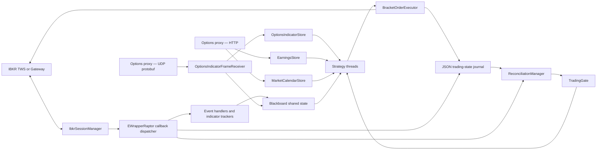

# Trading Engine

A Java 25 automated equity-trading engine built around the Interactive Brokers TWS API. The application owns IBKR connectivity, market-data subscriptions, shared trading state, indicator updates, risk checks, order lifecycle tracking, durable local intent journaling, and fail-closed broker reconciliation.

> [!CAUTION]
> This project is still under development and **must remain in PAPER** until the
> remaining-work items at the end of this README are complete. `Main` now
> instantiates `BracketOrderExecutor` and starts three strategy threads, so the
> engine **can** submit orders once reconciliation opens the trading gate.
> Two of those strategies, `ONE_SIGMA_DOWNSIDE` and `ONE_SIGMA_UPSIDE`, exist
> solely to generate executions for verification and are never to run live.

## Current status

| Subsystem | Status | Notes |
| --- | --- | --- |
| IBKR socket lifecycle | Implemented | Connects, starts the reader thread, reacts to important connectivity errors, and schedules reconnects. |
| Market-data subscriptions | Implemented with limitations | Requests daily history, updating one-minute history, and live or delayed ticks for strategy and reference symbols. |
| Indicators and shared state | Implemented | Maintains prices, bars, ATR, RSI, the rolling minute-volume baseline, and simple moving averages in the `Blackboard`, with per-input readiness tracked in `MarketDataInputStore`. |
| Account state | Implemented | Receives account callbacks. `ExcessLiquidity` is read under the tag IBKR actually sends. |
| Margin rates and concentration | Implemented; **the rate table is empty** | Per-ticker rates and GICS sectors load from `data/universe-reference.csv`, and per-ticker and per-sector caps reduce every entry. No rate has been collected yet, so all 30 symbols fall back to the conservative default. |
| Local trading-state journal | Implemented | Atomically writes order intent and broker acknowledgements to a JSON file with a backup. |
| Startup/reconnect reconciliation | Implemented | Collects a complete broker snapshot and blocks automation on any mismatch or timeout. It does not automatically alter broker state. |
| Bracket-order execution | Implemented and wired | `BracketOrderExecutor` supports a parent entry plus independent take-profit, stop-loss, and timed exits for each slice. Both strategies submit through the same instance. |
| Long downside mean-reversion strategy | Implemented and scheduled | Strategy ID is `TWO_SIGMA_DOWNSIDE`; the descriptive Java class is `TwoSigmaDownsideMeanReversionStrategy`. |
| Paper execution-verification strategies | Implemented and scheduled | Strategy IDs `ONE_SIGMA_DOWNSIDE` (long) and `ONE_SIGMA_UPSIDE` (short). Deliberately permissive, **PAPER only**; neither is intended to make money and neither will ever run live. |
| Options-proxy integration | Implemented | `OptionsIndicatorFrameReceiver` decodes UDP protobuf frames into `OptionsIndicatorStore`. All hard-coded implied moves are gone. |
| SPY gamma-flip input | Implemented | Delivered on every proxy frame and gated on validity, session date, and freshness. |
| Session logging and retention | Implemented | Console plus daily rolling files under `logs/`, a separate WARN/ERROR file, gzipped archives, and age and size based retention. |
| External liveness alerts | Not implemented | An independent alerting service is still required before unattended operation. |

## Intended runtime architecture



The receiver's arrow into the `Blackboard` is display-only: it mirrors accepted values onto `Stock` for the Swing monitor and is never read for a trading decision.

## Safety model

### Trading gate

`TradingGate` is the application-wide authority for new entries and automated order changes. Only `READY` allows them.

| Mode | Meaning |
| --- | --- |
| `STARTING` | Objects are being created; trading is closed. |
| `CONNECTING` | The engine is connecting or waiting to reconnect to TWS. |
| `RECONCILING` | Broker state is being collected and compared with local state. |
| `READY` | Reconciliation matched; automated entries and order changes may proceed. |
| `DEGRADED` | Connectivity or broker-data continuity was lost. |
| `MANUAL_INTERVENTION` | An unsafe or unresolved condition requires operator review. |
| `STOPPING` | The process is shutting down. |

`MANUAL_INTERVENTION` is intentionally sticky. The running process cannot transition back to an automated mode except by stopping. Review TWS, the account, open orders, positions, executions, and the JSON journal before restarting.

### Broker reconciliation

At startup and after relevant reconnect events, `ReconciliationManager` requests:

- all positions;
- all open orders;
- completed orders;
- executions.

The four streams must complete within 20 seconds. The engine then compares IBKR with its local journal for managed symbols, including order references, API and permanent IDs, account, symbol, contract, action, quantity, positions, executions, and recognized protective exits.

A clean comparison moves the gate to `READY`. A timeout, missing evidence, unexpected managed position, missing protective exit, identity mismatch, unreadable quantity, or other difference moves the engine to `MANUAL_INTERVENTION`.

Reconciliation is deliberately read-only: it does not cancel orders, recreate exits, flatten positions, or otherwise guess how to repair the account.

### Entry submission serialization

**Only one entry order may be unacknowledged at a time, engine-wide.** A single
lock in the `Blackboard` is taken before submission and released when IBKR
acknowledges the parent order — `WORKING_PARENT`, meaning it is live at the
exchange — or when the order terminates without acknowledgement. Every strategy
shares it, so no second order can be sent while the broker's response to the
first is still outstanding.

The lock is released on **acknowledgement, not on fill.** That distinction
matters both ways:

- Holding until fill would park the engine. There is no timeout once a parent
  reaches `WORKING_PARENT`, so one unfilled limit would block every strategy
  from entering indefinitely. The one-sigma strategies fire the moment price
  crosses their level, which is exactly when a limit is most likely to rest.
- Releasing on acknowledgement means several orders can be working at once.
  What bounds exposure from there is `MAX_ACTIVE_POSITIONS`: a ticker stays
  reserved from submission until it goes flat, so pending entries count against
  the cap alongside open positions.

### Account freshness

Releasing the lock at acknowledgement would let several entries be sized against
the same pre-order balance, so a second gate sits alongside it: **an entry may
only be sized against an account snapshot newer than the previous submission.**

IBKR charges initial margin when an order is *accepted*, not when it fills, so a
snapshot taken after the last acknowledgement already accounts for it.
`updateAccountTime` marks each batch of account values, `Blackboard` holds a
global submitted-at watermark, and `isAccountCurrentForNewEntry()` compares the
two. It returns false until the first batch arrives, so nothing can size against
defaults at startup.

The check runs **before** the serialization lock is taken. Inside it, a stale
account would make every strategy acquire and release the lock on each poll for
no purpose.

`AvailableFunds` is the field sizing compares against, and it is the correct
one. Each strategy's `calculateTotalQuantity` computes `shares × entryPrice ×
marginRate`, so the figure it produces is already a dollar requirement to be met
by un-leveraged equity. `BuyingPower` is that same equity multiplied by leverage
— comparing against it would apply the multiple twice and permit roughly four
times the intended size.

### Margin rates

Sizing multiplies against a per-ticker margin rate, and that rate is **read from a
file rather than measured**.

It used to be measured. `MarginPacer` submitted a what-if BUY and a what-if SELL
per symbol every five minutes and read `initMarginChange` off the returned
`OrderState`. IBKR asks for at most one what-if per minute and one per ten real
order submissions; with 31 symbols on a five-minute cycle that loop ran at
roughly **twelve a minute**, some 4,600 a session, and cancelled none of them. It
also swept SPY, which is reference-only and never traded. It is gone.

`data/universe-reference.csv` replaces it, one row per symbol:

```text
ticker,sector,regt_long,regt_short,pm_long,pm_short
```

Collect the rates from [IBKR's margin calculator](https://www.interactivebrokers.com/en/trading/margin-calculator.php).
`UniverseReference` loads the file once at startup and is immutable afterwards,
so no synchronization is involved in reading a rate.

Four properties of the loader are deliberate:

- **A blank rate falls back to a conservative default** — `DEFAULT_LONG_MARGIN_RATE`
  and `DEFAULT_SHORT_MARGIN_RATE`, both 0.50 — set *higher* than a typical
  requirement, so a symbol added to a universe and forgotten here under-sizes
  rather than over-leverages.
- **A missing file is not a startup failure.** Refusing to start over an unfilled
  reference table is worse than starting on defaults and saying so. Startup logs
  every traded symbol with no row and every symbol falling back.
- **A malformed sector or an out-of-range rate fails the whole file.** A typo that
  silently dropped a symbol out of its sector total would weaken a limit without
  saying so.
- **The table's age is warned past `UNIVERSE_REFERENCE_MAX_AGE_DAYS`.** IBKR
  reprices margin without notice, so an old table is a silent sizing error. That
  warning is what replaces the signal the what-if loop used to provide.

> [!IMPORTANT]
> **`MARGIN_METHODOLOGY` has no default and the engine will not start without
> it.** It must be `REG_T` or `PORTFOLIO`.
>
> Under Reg-T the initial requirement for long equity is the Federal Reserve's
> flat 50%, identical for every marginable symbol, and per-symbol variation
> appears only where IBKR imposes a house requirement above it. Under Portfolio
> Margin the requirement comes from the TIMS risk model — IBKR sweeps each
> position through simulated valuation moves of roughly ±15%, raises its stress
> factors during volatility, and can therefore **increase the requirement while
> prices are flat**. The two regimes size the same position differently and fail
> differently, so `EnvPropConfig` throws from its constructor rather than guess
> which one the account is on.

The engine does not yet *confirm* the declared regime against IBKR's own figures.
Confirmation would compare what IBKR charges against `RegTMargin`, and whether
that tag reaches an engine subscribed with `reqAccountUpdates` rather than
`reqAccountSummary` is an open question — `AccountEventHandler` logs each unread
account tag once at DEBUG so one live session settles it.

### Concentration limits

`ConcentrationLimits` caps how much of the account may ride on one symbol and on
one sector. This is account-level policy rather than strategy logic, and it has
to be shared: two strategies both entering technology names must see the same
sector total or neither limit means anything. **It only ever reduces** the
quantity a strategy asked for.

| Setting | Default | Meaning |
| --- | ---: | --- |
| `MAX_TICKER_EXPOSURE_PCT` | 30 | Percent of net liquidation on one symbol |
| `MAX_SECTOR_EXPOSURE_PCT` | 50 | Percent of net liquidation in one GICS sector |
| `MIN_POSITION_NOTIONAL` | 2000 | Below this the trimmed entry is abandoned rather than shipped |

Both limits apply under either margin regime. Concentration is how much is at
stake on one name; the regime only decides how much the broker lends against it.

**Exposure counts working entries, not just filled positions.** The engine-wide
entry lock is released on acknowledgement rather than on fill, so a second entry
can be admitted while the first still rests at the exchange. Reading only
`Stock.positionSize` would show nothing for it and let two same-sector entries
each pass the check and both fill. A partially filled bracket contributes its
filled half through the position size and its remainder through the bracket,
which composes rather than double-counting.

When the cap allows less than the strategy asked for, `trimToTotal` scales every
slice proportionally and gives the rounding loss to the first, because
`validateEntryIntent` requires the parts to sum exactly to the parent. If any
slice would round to **zero** the entry is abandoned instead: the strategy chose
how many exits the position has, and shipping fewer would hand it a shape it
never asked for.

One honest gap: a symbol with no row in the reference table has no sector, so
only the per-ticker cap can be enforced for it and its exposure is invisible to
every other symbol's sector total. That is a hole in the file, named at startup.

### Entry and position ownership

The strategy framework provides these safeguards:

- one owning strategy per symbol;
- a configured maximum number of active positions;
- per-ticker and per-sector exposure caps shared across strategies;
- global serialization of unacknowledged entry submissions;
- direction-specific limit-price acceptance for long and short trades;
- market-data freshness checks before entry evaluation and immediately before submission;
- pending-entry acknowledgement timeout handling;
- partial-fill and uncertain-submission escalation;
- per-symbol exception containment so one symbol cannot stop every strategy cycle;
- cleanup only after a confirmed flat or zero-fill terminal outcome;
- retained ownership when broker state is uncertain.

#### How a decision is assembled

Four pieces carry that list, and each exists to remove a specific way the old
shape could disagree with itself.

**Position state is derived, never stored.** `Stock.positionStateOf(boolean
owned, BracketOrder bracket)` computes `FLAT` / `PENDING` / `OPEN` from the
bracket's status and the caller's ownership answer. There is no field to write,
so the IBKR reader thread and a strategy thread cannot hold different views of
the same symbol. A terminal bracket reads `FLAT` while the ticker is still
reserved, which is what lets cleanup notice the trade finished; a terminal status
that followed a fill reads `OPEN`, because a live position was left behind.

**Each decision reads one frozen view.** `Stock` holds every market-data figure
in its own `volatile` field, written as ticks arrive, so a strategy reading those
fields directly could assemble one decision from several different moments in the
tape. `MarketSnapshot.of(Stock, long)` takes them in a single pass, and every
strategy hook that reads market data takes the snapshot instead. `evaluateNewEntry`
takes two: one to screen with, and a second **after** the entry lock is held —
that second one is the only view the order is built from, so the price the gate
approved is the price the order rests at.

**The entry claim lives in one place.** `EntryAdmission.tryAdmit` performs the
three steps — take the engine-wide pending lock, reserve the ticker, confirm the
symbol still derives `PENDING` — and unwinds in reverse on any failure. It hands
back an `AutoCloseable` `Reservation`; `keep()` passes both claims to the
pending-entry lifecycle and `close()` releases them, so a path nobody considered
frees the engine-wide lock rather than parking every strategy behind it.

**Broker statuses are acknowledged exactly once.** Deriving the state removed the
lag that used to make each status observable a single time, so
`acknowledgedStatus` restores it explicitly: a per-ticker map of the last status
this strategy acted on. Releasing the global lock on `WORKING_PARENT`, escalating
a partial fill, and clearing the pending maps on `POSITION_OPEN` are all
edge-triggered off it rather than off a poll.

Strategies also see a narrowed blackboard. `StrategyBlackboard` composes
`PositionLedger` (the two claims) and `StockLookup` (`getStock`) plus the account
gate and the halt switch. A strategy holding that type cannot allocate an IBKR
order ID, reach `OrderRegistry`, or iterate every symbol. `Blackboard` implements
it, so nothing else changed at the call sites.

## Startup and reconnect lifecycle

1. `Main` loads configuration and creates the shared `Blackboard`, trading gate, broker-state collector, JSON journal, handlers, market-data subscriptions, and background services.
2. Recovery from a backup journal is logged. A non-terminal local trade immediately latches `MANUAL_INTERVENTION` before broker reconciliation begins.
3. `IbkrSessionManager` connects to the configured TWS host, derived port, and client ID.
4. After `nextValidId`, it selects the requested market-data type, requests broker time, initializes subscriptions, and begins reconciliation.
5. Reconciliation opens the gate only if the complete IBKR snapshot matches the local journal.
6. Socket closure or IBKR connectivity loss marks market data stale and closes the trading gate.
7. Reconnect restores subscriptions as needed and repeats reconciliation before automation can resume.

Handled IBKR connectivity codes currently include 1100, 1101, 1102, 1300, 502, 504, and 509.

## Current strategy design

`TwoSigmaDownsideMeanReversionStrategy` is a long-only, intraday mean-reversion strategy. Its stable runtime identity is `TWO_SIGMA_DOWNSIDE`; persisted trades and order references must use the stable identity rather than the Java class name.

The strategy code currently evaluates:

- time before 3:00 PM New York;
- a Static Daily Implied Move and SPY Gamma Flip that the options proxy marked valid for the current session and delivered recently;
- fresh SPY data and SPY at or above the proxy's gamma flip;
- a structural level at previous close minus two static daily implied moves;
- a one-minute bar that reached the structural level;
- a volume climax of at least three times the rolling 15-minute baseline, which
  is unavailable for roughly the first 15 minutes of the session;
- a close in the upper half of the minute-bar range;
- sufficient reward from entry to daily VWAP relative to assumed risk.

Position sizing targets 0.25% of net liquidation value at risk, then caps size by available funds at the ticker's configured long margin rate, and finally by the per-ticker and per-sector concentration limits. The 0.25% figure is hardcoded in this strategy rather than shared or configured, so a change to one strategy's risk budget can never move another's. The bracket is divided into two equal slices:

- one mathematical profit target at one implied move above entry;
- one VWAP target;
- a common initial stop one-half implied move below entry;
- a 3:45 PM New York timed exit for each slice.

Open-position management contains break-even adjustments, a VWAP target adjustment, and an emergency marketable-limit exit path. These rules require PAPER validation before activation.

### Required strategy inputs

| Input | Current source | Readiness |
| --- | --- | --- |
| Bid, ask, last, mark, OHLC, previous close | IBKR market-data ticks | Wired |
| Session VWAP | IBKR `RT_VOLUME` string tick (generic tick 233) | Wired; **requires a real-time subscription** |
| Daily history and simple moving averages | IBKR historical data | Wired |
| Updating one-minute bars, ATR, RSI, and the minute-volume baseline | IBKR updating historical data | Wired |
| Account values | IBKR account callbacks (`reqAccountUpdates`) | Wired |
| Per-ticker margin rates and sectors | `data/universe-reference.csv` via `UniverseReference` | Wired; **file has no rates yet** |
| Static Daily Implied Move | Options-proxy UDP frames via `OptionsIndicatorStore` | Wired |
| SPY gamma flip | Options-proxy UDP frames via `OptionsIndicatorStore` | Wired |
| Per-input validity, coverage, and readiness | `MarketDataInputStore` | Wired |
| Next earnings dates | Options-proxy `GET /earnings` via `EarningsStore` | Wired |
| Session hours and market days | Options-proxy `GET /calendar` via `MarketCalendarStore` | Wired |

### Market-data readiness

Every IBKR-sourced input is tracked independently in `MarketDataInputStore`.
Readiness previously worked per symbol: any arriving tick marked a symbol fresh,
and only an explicit resubscribe cleared it. One bid-size tick therefore made a
symbol look ready even if its previous close, VWAP, or minute bars had never
arrived, and a stream that froze mid-session stayed "fresh" indefinitely.

| Input | Expiry |
| --- | --- |
| `LAST_PRICE` | Aged, `MARKET_DATA_MAX_AGE_MS` |
| `PREVIOUS_CLOSE` | Session-scoped |
| `DAILY_VWAP` | Aged |
| `MINUTE_BAR` | Aged |
| `MINUTE_VOLUME_BASELINE` | Aged |

The previous close is session-scoped because IBKR sends it once when the
subscription opens and effectively never again; an age limit would discard a
value that stays correct all day. It lapses when the New York date changes or
when subscriptions are rebuilt.

`DAILY_VWAP` is the one input that does not arrive as a price tick. **IBKR sends
no VWAP price-tick field** — `TickType` runs 0 to 104 and contains none. The
figure travels inside `RT_VOLUME` (tick type 48), a semicolon-delimited *string*
tick enabled by generic tick `233`, which `requestLiveMarketData` already
requests:

```
price;size;time;totalVolume;VWAP;singleTradeFlag
```

`PriceTickHandler.onTickString` reads field five. The payload is rejected unless
it has at least five fields and the VWAP parses to a positive finite number, so a
shape change is ignored rather than misread as a price.

**This requires a real-time market-data subscription.** The delayed tick family
runs 66 `DELAYED_BID` through 76 `DELAYED_OPEN` and has no `RT_VOLUME`
equivalent, so a delayed feed carries no VWAP at all. Under delayed data
`DAILY_VWAP` is never recorded and every strategy stays gated out of entry —
correct behaviour for a value that genuinely is not being received, but it means
**no orders will be placed until live data is enabled.**

The first accepted `RT_VOLUME` payload per symbol is logged at INFO with the raw
string alongside the parsed value. The field order above comes from IBKR's
documentation rather than the `JavaClient` source, so that line makes it a
five-second check against a real session instead of a standing assumption.

Only handlers record inputs, and only after accepting a value, so a ready input
carries a real guarantee: a validated number reached the `Blackboard`. The
values themselves stay in `Stock` and are never duplicated here, so the two
cannot disagree about a number. The volume baseline is recorded only once its
15-bar window is full, so a partial window is never reported ready.

A strategy declares two sets. `requiredEntryInputs()` must all be usable before
an entry is evaluated; `requiredManagementInputs()` must all be usable before
resting exits are repriced. The management set is deliberately narrower, so a
position is never stranded by an input it does not use. When management inputs
are unusable the engine leaves the broker-side exits in force rather than acting
on a frozen value — a stale VWAP would otherwise read as a large negative reward
and trip the ripcord into a spurious 1.5% deep-sweep liquidation.

Entry readiness transitions are logged once per change rather than per poll, so
a strategy that stops trading says why without flooding the log.

### Minute-volume baseline

`MinuteVolumeTracker` owns both figures the volume-climax lock compares:

| Field | Meaning |
| --- | --- |
| `lastMinuteVolume` | Volume of the newest bar, which during live trading is the minute still forming |
| `averageLast15MinuteVolume` | Mean volume of the 15 **completed** minute bars before it, current session only |
| `averageDailyVolume` | IBKR tick 21, the 90-day average **daily** volume. Reference only |

The forming minute is excluded from its own baseline, so a relative volume of
3.0 means a minute trading three times the recent norm. Including it would
silently raise the effective threshold, because the spike would inflate the
average it is measured against.

The window covers the current session only. The previous day's closing ramp
carries far more volume than a typical minute, so letting it survive overnight
would inflate the opening baseline and suppress entries during the most active
period of the day.

Until 15 completed same-session bars exist the baseline is published as zero,
which the strategy treats as unusable. With regular trading hours starting at
09:30 the baseline becomes available at about 09:45; entries are blocked until
then rather than evaluated against an approximation.

Because `keepUpToDate` re-delivers the forming bar repeatedly, a bar is
committed to the window only once a bar with a later timestamp proves it closed.
A replayed history dump after a resubscribe is ignored until it passes the
newest bar already held, so the window survives a reconnect instead of being
rebuilt backwards.

`averageLast15MinuteVolume` was previously populated from IBKR tick 21, the
90-day average daily volume. No single minute can exceed that threefold, so the
volume-climax lock could never pass and the strategy could not open a position.

## Repository layout

```text
src/main/java/mwd/trading/
├── app/             Application composition and startup
├── broker/ibkr/     IBKR session, EWrapper dispatch, IDs, requests, and callbacks
├── calendar/        Session hours and market days pulled from the proxy
├── config/          Properties and environment-variable configuration
├── domain/          Account, stock, and trade-direction state
├── earnings/        Earnings dates pulled from the proxy
├── execution/       Bracket construction, order registry, and order lifecycle
├── indicator/       ATR, RSI, volume, and moving-average calculations/trackers
├── lifecycle/       Engine modes and the global trading gate
├── marketdata/      Subscription lifecycle, tick/bar handlers, per-decision snapshots
├── optionsproxy/    UDP protobuf receiver and validated indicator store
├── persistence/     Atomic JSON trading-state journal
├── proxy/           Shared HTTP/JSON fetch used by earnings and calendar
├── reconciliation/  Broker snapshot collection and comparison
├── risk/            Margin regime, per-ticker reference table, concentration caps
├── state/           Shared Blackboard, narrow strategy views, ownership controls
├── strategy/        Strategy framework, entry admission, concrete strategies
└── ui/              Optional Swing Blackboard monitor

src/test/java/       JUnit tests
src/main/proto/      Options-proxy wire contract; generates Java during the build
src/main/resources/  Runtime configuration and Log4j configuration
data/                Runtime state files, ignored by Git, **except**
                     universe-reference.csv, which is committed
logs/                Rolling session logs; ignored by Git
```

There is **no Python in this repository.** Earnings dates are pulled from the
options proxy over HTTP; the engine no longer launches a subprocess for them.

## Requirements

- JDK 25
- Maven 3.9 or newer
- IBKR Trader Workstation or IB Gateway with API socket access enabled
- IBKR Java API 10.39.1 installed in the local Maven repository
- Eclipse with m2e, if using the existing IDE workflow
- The options proxy running and reachable, for implied move, gamma flip, and earnings

The `JavaClient` source tree is an external IBKR dependency and must not be modified as part of this project.

## Setup

### 1. Install the IBKR Java client artifact

On each machine, install the unmodified IBKR `JavaClient` project into that machine's local Maven repository:

```powershell
cd D:\dev-tools\TWS_API\source\JavaClient
mvn install -DskipTests
```

Use the corresponding path on Ubuntu. The supplied JavaClient POM installs:

```text
com.interactivebrokers:tws-api:10.39.1
```

### 2. Build and test the engine

From the trading-engine repository:

```powershell
mvn clean test
mvn package
```

The tests deliberately exercise failure paths, so ERROR-level log messages can appear during a successful test run. Maven's final test result is authoritative.

### 3. Import into Eclipse

1. Import the repository as an **Existing Maven Project**.
2. Set the installed JRE and project compiler to Java 25.
3. Run **Maven > Update Project**.
4. Run **Project > Clean**.
5. Launch `mwd.trading.app.Main` as a Java application.

If Eclipse resets the project to Java 8, restore the project JRE and compiler compliance to Java 25 before building or launching.

## Configuration

Baseline values live in `src/main/resources/config.properties`. A nonblank operating-system environment variable with the same name overrides the property. The engine does **not** currently load a `.env` file.

| Key | Repository default | Purpose |
| --- | --- | --- |
| `LIVE_IBKR_DATA` | `false` | Market-data quality only. Selects the IBKR market-data type and the tick-field mapping. |
| `LIVE_IBKR_TRADING` | `false` | Which account receives orders. Selects the TWS port and the default state path. |
| `SHOW_UI` | `false` | Opens the Swing Blackboard monitor when true. |
| `STRATEGY_POLL_RATE_MS` | `16` | Delay between complete strategy-universe cycles once a strategy is started. |
| `ENTRY_ACKNOWLEDGEMENT_TIMEOUT_MS` | `10000` | Time before an unacknowledged entry is escalated. |
| `MAX_ACTIVE_POSITIONS` | `3` | Maximum number of symbols reserved across strategies, counting pending entries. |
| `STRATEGY_TWO_SIGMA_DOWNSIDE_UNIVERSE` | 30 equities | Symbols the downside strategy may trade. |
| `STRATEGY_TWO_SIGMA_DOWNSIDE_REFERENCE_SYMBOLS` | `SPY` | Non-traded symbols required by the strategy. |
| `IBKR_HOST` | `127.0.0.1` | TWS or Gateway API host. |
| `IBKR_CLIENT_ID` | `0` | IBKR API client ID. Use a unique value for each simultaneous engine connected to the same TWS session. |
| `IBKR_EXPECTED_ACCOUNT` | blank | Optional required account. If configured and not returned by IBKR, the engine enters manual intervention. Strongly recommended for both PAPER and LIVE. |
| `IBKR_RECONNECT_DELAY_MS` | `5000` | Delay before a socket reconnect attempt. |
| `TRADING_STATE_PATH` | mode-derived | Overrides the JSON journal path. Defaults to `data/trading-state-paper.json` or `data/trading-state-live.json`. |
| `OPTIONS_PROXY_ENABLED` | `true` | Starts the options-proxy UDP listener. When false, no indicators are received and no strategy depending on them can open a position. |
| `OPTIONS_PROXY_BIND_HOST` | `127.0.0.1` | Local address the UDP socket binds to. Use the Ethernet address when the proxy runs on the other laptop. |
| `OPTIONS_PROXY_UDP_PORT` | `5005` | Local UDP port. Must match the proxy's `UDP_PORT`. |
| `OPTIONS_PROXY_FRAME_MAX_AGE_MS` | `5000` | Age beyond which the newest frame stops satisfying new entries. The proxy broadcasts once per second by default. |
| `MARGIN_METHODOLOGY` | `REG_T` in the file; **no default in code** | `REG_T` or `PORTFOLIO`. Selects which pair of rates in the reference table applies. Absent or unrecognised throws at startup. |
| `UNIVERSE_REFERENCE_PATH` | `data/universe-reference.csv` | Per-ticker sectors and margin rates. A missing file logs and falls back to defaults rather than refusing to start. |
| `DEFAULT_LONG_MARGIN_RATE` | `0.50` | Rate used when a ticker has no row or a blank long rate. Deliberately conservative. |
| `DEFAULT_SHORT_MARGIN_RATE` | `0.50` | Same, for the short side. |
| `UNIVERSE_REFERENCE_MAX_AGE_DAYS` | `30` | Age past which the table's `# retrieved:` date triggers a startup warning. |
| `MAX_TICKER_EXPOSURE_PCT` | `30` | Percent of net liquidation permitted on one symbol, filled plus working. |
| `MAX_SECTOR_EXPOSURE_PCT` | `50` | Percent of net liquidation permitted in one GICS sector. |
| `MIN_POSITION_NOTIONAL` | `2000` | An entry trimmed below this is abandoned rather than shipped. |
| `MARKET_DATA_MAX_AGE_MS` | `30000` | Age beyond which an aged IBKR input stops being usable. Must exceed the slowest input's cadence, which is the one-minute bar stream. Verify the real cadences during PAPER and tighten this. |
| `ENGINE_LOG_DIR` | `logs` | Directory for the rolling log files. |
| `ENGINE_LOG_NAME` | `trading-engine` | Base name of the log files. Must differ between engines sharing a working directory. |
| `ENGINE_LOG_RETENTION` | `P90D` | ISO-8601 age beyond which gzipped archives are deleted. |
| `ENGINE_LOG_RETENTION_BYTES` | `5 GB` | Accumulated archive size beyond which the oldest are deleted, whichever limit is reached first. |
| `EARNINGS_ENABLED` | `true` | Starts the earnings refresher. When false, no dates are retrieved and any strategy depending on them cannot open a position. |
| `EARNINGS_ENDPOINT_URL` | `http://127.0.0.1:8000/earnings` | The proxy's earnings endpoint. Point at the proxy laptop's address when the engine runs elsewhere. |
| `EARNINGS_CONNECT_TIMEOUT_MS` | `3000` | Connect timeout for an earnings request. |
| `EARNINGS_REQUEST_TIMEOUT_MS` | `5000` | Read timeout for an earnings request. |
| `EARNINGS_RETRY_DELAY_MS` | `30000` | Delay before retrying after a failed refresh. Shared by the market-calendar refresher. |
| `MARKET_CALENDAR_ENDPOINT_URL` | `http://127.0.0.1:8000/calendar` | The proxy's calendar endpoint. Supplies the session close that all entry and exit timing derives from. |
| `STRATEGY_ONE_SIGMA_DOWNSIDE_UNIVERSE` | same as the two-sigma universe | Symbols the long paper verification strategy trades. Set it empty to stop that strategy from running. |
| `STRATEGY_ONE_SIGMA_UPSIDE_UNIVERSE` | same as the two-sigma universe | Symbols the short paper verification strategy trades. Set it empty to stop that strategy from running. |
| `STRATEGY_ONE_SIGMA_*_REFERENCE_SYMBOLS` | empty | Neither reads a market index, so neither needs any. |

### Mode-derived settings

Two independent flags. `LIVE_IBKR_DATA` decides what the engine *sees*;
`LIVE_IBKR_TRADING` decides where its orders *go*.

| `LIVE_IBKR_DATA` | IBKR market-data type | Tick fields | VWAP available |
| --- | ---: | --- | --- |
| `false` | 3 — delayed | delayed ids (66–76) | **no** |
| `true` | 1 — real-time | live ids | yes |

| `LIVE_IBKR_TRADING` | TWS port | Default journal |
| --- | ---: | --- |
| `false` | 7497 | `data/trading-state-paper.json` |
| `true` | 7496 | `data/trading-state-live.json` |

They were one flag until it became clear what that costs: buying a real-time
subscription for the PAPER engine and setting the single flag to `true` would
also have pointed it at the LIVE port and the LIVE journal. A change made for
data quality would have redirected order flow.

Three of the four pairings are legitimate — PAPER on delayed, PAPER on
real-time, LIVE on real-time. The fourth, **LIVE trading on delayed data**,
throws at startup rather than pricing real orders off a quote that is fifteen
minutes old.

Because VWAP arrives only on a real-time subscription and gates every strategy,
`LIVE_IBKR_DATA=false` means **no orders will be placed at all**. That is the
correct conservative outcome, not a fault to debug.

The port is currently derived and cannot be overridden with an `IBKR_PORT` setting. Configure TWS/Gateway to match, or update `Config` and `EnvPropConfig` before using a nonstandard port.

### PAPER example on Windows

Set these values in the Eclipse launch configuration or the PowerShell process that starts the engine:

```powershell
$env:LIVE_IBKR_DATA = 'false'      # 'true' once a real-time subscription is shared to PAPER
$env:LIVE_IBKR_TRADING = 'false'   # keep false: orders stay on the paper account
$env:IBKR_HOST = '127.0.0.1'
$env:IBKR_CLIENT_ID = '20'
$env:IBKR_EXPECTED_ACCOUNT = 'DU1234567'
$env:MARGIN_METHODOLOGY = 'REG_T'    # required; REG_T or PORTFOLIO, no default
$env:TRADING_STATE_PATH = 'data/trading-state-paper.json'
$env:OPTIONS_PROXY_ENABLED = 'true'
$env:OPTIONS_PROXY_BIND_HOST = '127.0.0.1'
$env:OPTIONS_PROXY_UDP_PORT = '5005'
$env:OPTIONS_PROXY_FRAME_MAX_AGE_MS = '5000'
$env:ENGINE_LOG_NAME = 'paper-engine'
```

These are also the repository defaults, so a same-laptop PAPER test needs no options-proxy overrides at all. `ENGINE_LOG_NAME` is worth setting anyway so a PAPER session's logs are never confused with a LIVE one's.

### LIVE example on Ubuntu

Do not use this profile until the strategy, proxy inputs, and PAPER checklist are complete:

```bash
export LIVE_IBKR_DATA=true
export LIVE_IBKR_TRADING=true
export IBKR_HOST=127.0.0.1
export IBKR_CLIENT_ID=10
export IBKR_EXPECTED_ACCOUNT=U1234567
export MARGIN_METHODOLOGY=REG_T      # required; must match the real account
export TRADING_STATE_PATH=data/trading-state-live.json
export ENGINE_LOG_NAME=live-engine
```

Use the actual account IDs and client IDs for each installation. Never share a journal file or a log file between PAPER and LIVE instances.

## Options-proxy integration

The Python options proxy broadcasts one `options_proxy.IndicatorFrame` UDP datagram per ticker per interval. The engine consumes them with `OptionsIndicatorFrameReceiver` and stores them in `OptionsIndicatorStore`.

### Wire contract

`src/main/proto/market_state.proto` is a byte-identical copy of the proxy's `proto/market_state.proto`. **Both copies must change together.** The Maven build runs `protobuf-maven-plugin`, which downloads a `protoc` matching the `protobuf.version` property and generates `mwd.trading.optionsproxy.proto.*` into `target/generated-sources/protobuf` during `generate-sources`. No generated Java is committed.

In Eclipse, run **Maven > Update Project** after changing the contract so the generated sources folder is refreshed.

### Receiver

A daemon thread binds `OPTIONS_PROXY_BIND_HOST:OPTIONS_PROXY_UDP_PORT` and parses each datagram. Because the proxy broadcasts continuously, **start order does not matter**: whichever process starts second picks up the next frame. Unparseable datagrams are dropped and counted. `stop()` closes the socket and joins the thread.

### Store and validity rules

`OptionsIndicatorStore` is the single source of truth. A frame is rejected unless all of the following hold:

- the ticker is in the engine's own universe (frames for other symbols are ignored, not stored);
- `trading_date` parses as strict `YYYY-MM-DD`;
- `emitted_at_unix_ms` is positive and not further into the future than the max-age window;
- `sequence` is positive and advances past the last accepted sequence **for that ticker**;
- any indicator flagged valid carries a finite, strictly positive number.

A validity flag — never a `0.0` value — decides whether an indicator is usable. Sequences are tracked per ticker, so one symbol cannot starve another. If the stream goes silent longer than the max-age window, a lower sequence is accepted again so a restarted proxy resynchronizes on its own.

### What gates a new entry

`TwoSigmaDownsideMeanReversionStrategy` opens a position only when, for the current New York date:

1. the ticker's Static Daily Implied Move is explicitly valid and stamped for today;
2. the SPY Gamma Flip is explicitly valid and stamped for today;
3. the newest frame arrived within `OPTIONS_PROXY_FRAME_MAX_AGE_MS`;
4. every input in `requiredEntryInputs()` is individually usable, and SPY has a
   usable last price of its own;
5. the ticker is outside its earnings blackout, one market day either side of a
   known report date;
6. the session close is known and more than 60 minutes away.

Yesterday's values never satisfy today. If the gamma flip is entered after the open, the proxy hot-reloads the file and the next frames become valid — the strategy resumes evaluating entries with **no restart required**.

### Behavior when the proxy is lost

Losing proxy data blocks **new entries only**. It must never strand an open position:

- the emergency ripcord exit needs no options data at all and always runs;
- break-even and trailing adjustments use the last accepted implied move, which the store retains indefinitely;
- the values copied onto `Stock` exist solely for the Swing monitor and are never read by strategy logic.

### Same-laptop verification

With repository defaults, start the proxy and the engine in either order on the Windows laptop and confirm the engine logs `Listening for options-proxy frames on 127.0.0.1:5005`. The proxy's `GET /health` reports per-ticker coverage; `TICKERS` there should match `STRATEGY_TWO_SIGMA_DOWNSIDE_UNIVERSE` here, since the engine drops frames for symbols outside its universe.

For the eventual two-laptop split, the proxy still needs multiple UDP destinations — Windows localhost for PAPER and the Ubuntu laptop's Ethernet address for LIVE. That is not required for same-laptop testing.

## TWS/Gateway operating assumptions

- The API socket must be enabled and listening on the mode-derived port.
- The configured client ID must not conflict with another connected API client.
- `IBKR_EXPECTED_ACCOUNT` should identify the intended account.
- The account must have the required market-data permissions for LIVE mode; PAPER mode currently requests delayed data type 3.
- TWS/Gateway must remain authenticated and operational. The engine reconnects the API socket but cannot complete an interactive TWS login.
- If TWS reports a port change through error 1300, the engine attempts to parse the new port and reconnect.

## Runtime files and observability

### Trading-state journal

The engine writes the configured state file atomically:

1. serialize to `<name>.tmp`;
2. force the temporary file to disk;
3. copy the previous primary file to a sibling backup such as `trading-state-paper.backup.json`;
4. replace the primary file, using an atomic move when supported.

The journal records intent and the last observed order-leg state. IBKR remains the authority. Do not delete or edit the journal merely to bypass manual intervention; first verify the actual account, positions, executions, and working orders in TWS.

### Earnings dates

Earnings dates are **pulled** from the options proxy over HTTP rather than
received on the UDP stream. The proxy fetches them once each morning and they
are static for the session, so a request/response lifecycle fits where a 1 Hz
broadcast would be redundancy with no principled stopping point.

`EarningsRefresher` runs on its own daemon thread: fetch once per trading date,
retry on `EARNINGS_RETRY_DELAY_MS` while a session is uncovered, then idle. A
repeated failure logs once and logs again on recovery, so a proxy that is down
for an hour leaves two lines rather than hundreds.

`EarningsStore` holds whole snapshots and is **session-scoped with no age
limit**. A snapshot carries the session it was computed for, so yesterday's
answer stops being usable the moment the New York date rolls over, whether or
not a refresh has succeeded yet. That is the failure worth designing against: a
stale earnings date surviving into a new session is how a strategy trades into a
report it believed was days away.

Two deliberate choices:

- **Whole snapshots, never merged per ticker.** A merge would let two sessions'
  answers coexist with no single date to check them against.
- **An unresolved ticker is absent, not present with a null date.** The proxy's
  `valid` flag is authoritative, and the client drops anything it does not
  satisfy, so nothing downstream can read "unknown" as "no earnings scheduled".

`daysUntilEarnings` reports **calendar days**. Strategies needing market days
measure them against `MarketCalendarStore` instead, which is what StrategyC's
blackout does.

### Market calendar

`MarketCalendarStore` holds the current session's status and hours, plus the
closed dates the proxy's feed carries. **The engine encodes no market hours of
its own** — both the standard 09:30-16:00 session and any early close are
resolved by the proxy, which owns the holiday feed.

Its session arithmetic is deliberately minimal: `isSession` is a weekday the
feed does not mark closed, and `nextSession` / `previousSessionApproximate`
walk one day at a time from there. The richer arithmetic stays in the proxy;
keeping the engine's copy this small is what stops the two from drifting.

Two honest limitations:

- `coversDate` returns false before the current session and beyond the cache's
  last record. Outside that window a missing holiday record means *unknown*,
  not *open*, and `isSession` returns false rather than guessing.
- `previousSessionApproximate` is named for what it is. Massive's feed is
  forward-looking, so a holiday immediately *before* the current session is not
  in the cache and cannot be detected. It skips weekends and known closures and
  otherwise returns the previous weekday.

## `ONE_SIGMA_DOWNSIDE` and `ONE_SIGMA_UPSIDE` — paper execution verification

**These strategies exist to make trades happen, not to make money.** They verify
that the order path works end to end in PAPER: submission, acknowledgement,
fills, bracket exits, take-profit modification, stop-loss, time exit, and
reconciliation. **Neither will ever run on a live account.**

`TWO_SIGMA_DOWNSIDE` fires rarely by design — two-sigma capitulation is an
uncommon setup, so a session producing zero entries is its *expected* outcome
and tells you nothing about whether execution works. These fire often enough to
answer that, and the pair covers both order directions.

| | `ONE_SIGMA_DOWNSIDE` (long) | `ONE_SIGMA_UPSIDE` (short) |
| --- | --- | --- |
| Entry | Previous close **−** 1.0 × move, when price is already at or **below** it | Previous close **+** 1.0 × move, when price is already at or **above** it |
| Take profit | Daily VWAP, tracked while open | Daily VWAP, tracked while open |
| Stop loss | Previous close **−** 1.25 × move | Previous close **+** 1.25 × move |
| Veto | VWAP **below** previous close − 0.75 × move | VWAP **above** previous close + 0.75 × move |
| Margin rate | `universeReference.marginRate(ticker, true)` | `universeReference.marginRate(ticker, false)` |

Both share the rest:

| | |
| --- | --- |
| Time exit | Two hours after submission, or 15 minutes before the close, whichever is first |
| Entry cutoff | No new position within 60 minutes of the close |
| Re-entry | 15-minute per-ticker cooldown after an exit |
| Sizing | 0.25% of net liquidation at risk |

Each direction reads its own side of the reference table. The rates used to be
measured per symbol per direction by what-if order, and each strategy gated on a
separate `isLongMarginRateVerified()` / `isShortMarginRateVerified()` flag so a
BUY what-if alone could not let the short size against an unpriced default. Both
the flags and the what-if loop are gone: a configured rate is present from
startup, and a symbol without one gets the conservative default rather than a
gate.

### Implemented independently, on purpose

The two are near mirrors and share no base class beyond `AbstractStrategy`.
Strategies diverge, and a change made for one must never silently alter the
other's behaviour.

### What it deliberately does not check

No volume climax, no wick rejection, no structural-touch requirement, no SPY
gamma-flip filter, and no earnings blackout. Dropping those is what makes them
fire. **The long side will catch falling knives and the short side will short
strength that keeps going** — exactly what a real strategy's filters exist to
avoid. That is the trade being made for frequency.

They do still require the four inputs they actually read — last price, previous
close, VWAP, and a valid implied move. Computing an entry from a default zero
previous close is not a policy choice. Note that neither needs a **volume
baseline**, so unlike the two-sigma strategy they can trade from the opening
bell rather than waiting for the 15-bar window to fill.

### The 0.75σ veto

Risk is 0.25 moves (entry to stop). A VWAP 0.75 moves from the previous close
leaves reward of exactly 0.25 moves, so the veto skips anything worse than
one-to-one, in either direction.

### Take-profit tracking and the Order Efficiency Ratio

IBKR expects the OER — messages (submissions, modifications, cancellations)
divided by executions — to stay near 20 or below, and tracks it server-side.

The target follows VWAP **in both directions with no floor**. Two consequences
are expected behaviour, not defects: once VWAP crosses the entry the exit limit
becomes marketable and the position closes at a loss — a sell limit below market
for the long, a buy-to-cover limit above market for the short — and if VWAP
passes the stop level the take-profit simply fills first.

Tracking is bounded three ways: at most **10 updates per position**, no more
than one per **60 seconds**, and only when VWAP has moved at least **$0.05**.
`updateTripleThreatExits` re-transmits only a leg whose price actually changed,
so a VWAP-only move costs one message. Worst case is 3 placement messages plus
10 modifications against 2 executions — an OER near 6.5.

The re-entry cooldown protects the same budget. Without it a ticker parked below
the entry level round-trips continuously — enter, VWAP-driven exit, re-enter —
which is churn rather than verification.

### Shared limits

All three strategies submit through one `BracketOrderExecutor` and share
`MAX_ACTIVE_POSITIONS`, which is **3**. Because these two fire far more often,
**expect them to occupy most of the position slots** and `TWO_SIGMA_DOWNSIDE` to
rarely get one.
Per-ticker ownership in the `Blackboard` still prevents two strategies holding
the same symbol, so the long and short pair cannot both take the same ticker.

## `TWO_SIGMA_DOWNSIDE` policy

**Earnings blackout: one market day either side of the report.** A two-sigma
drop on an earnings day is plausibly a repricing of the business rather than the
panic this strategy fades, and an intraday-only exit gives no protection against
entering one. Measured in market days, so a weekend does not consume the window:
a Friday report blacks out the following Monday.

The window is tested against **both** dates the proxy publishes. The retained
`last_earnings_date` is what makes the day-after rule work at all: the upstream
source rolls some tickers to next quarter the moment they report, so the
upcoming date alone would leave nothing to measure against for those symbols
and the rule would silently apply to some tickers and not others.

The window is measured outward from today rather than from the report date, so
the session walk only touches days adjacent to the current session, which are
the ones the proxy's forward-looking feed can answer for.

The gate **fails closed**: no earnings date at all, or no calendar to measure
sessions with, blocks the entry. An unknown report date is not evidence of its
absence. A ticker holding only a *past* date is not in that category — that is
knowledge, and it trades normally once outside the window.

**Entry and exit timing derive from the real close, with no hardcoded times.**

| Rule | Value |
| --- | --- |
| No new entry within | 60 minutes of the close |
| Time exit on every slice | 15 minutes before the close |

On a 16:00 close that is a 15:00 cutoff and a 15:45 exit, matching the previous
hardcoded values. On an early close at 13:00 it becomes a 12:00 cutoff and a
12:45 exit, which the hardcoded version got badly wrong: it would have allowed
entries until 15:00 and stamped exits for 15:45, both after the market had shut.
The first exposure is 2026-11-27.

Accepted dates are mirrored onto `Stock` for the monitor's Earnings column. Those
copies carry no session or validity information and must never be read by a
strategy; `EarningsStore` is the source of truth.

### Logging

Log4j2 writes INFO-and-higher events to the console and to two rolling files
under `logs/`:

| File | Contents |
| --- | --- |
| `${ENGINE_LOG_NAME}.log` | Everything at INFO and above |
| `${ENGINE_LOG_NAME}-problems.log` | WARN and ERROR only |

The problems file exists because a full session produces a great deal of INFO;
it is the file to open first when something went wrong. Both roll daily, and
also at a size cap, and archives are gzipped as
`${ENGINE_LOG_NAME}-YYYY-MM-DD-N.log.gz`. Archives are deleted once they pass
`ENGINE_LOG_RETENTION`, or when the accumulated archive size passes
`ENGINE_LOG_RETENTION_BYTES`.

`logs/` and `*.log` are already excluded from Git.

**`ENGINE_LOG_NAME` must differ between engines that share a working
directory**, for the same reason `TRADING_STATE_PATH` must: two JVMs rolling one
file will corrupt each other's rollover. The normal deployment runs LIVE and
PAPER on separate machines, so the default is safe there.

Startup writes a header naming the resolved log path, the IBKR data mode, the
readiness limits, and the journal path, so a later investigation can tell which
run produced a file and under what configuration.

Two deliberate choices support using these logs as evidence after an unexpected
stop:

- **Log4j's own shutdown hook is disabled.** It otherwise races the engine's
  shutdown hook and can swallow the disconnect and shutdown sequence, which is
  the part worth reading. `Main` calls `LogManager.shutdown()` as the last
  statement of its own hook instead. Nothing may log after that call.
- **The async queue-full policy is `Default`, not `Discard`.** The previous
  setting silently dropped INFO and below whenever the ring buffer filled, which
  happens during a callback burst such as an IBKR reconnect storm — precisely
  when the log is the only record of what the engine did. `Default` applies back
  pressure to the calling thread instead, so a busy moment slows logging rather
  than erasing it. These strategies are medium frequency by design, so the trade
  is worth taking.

There is still no health endpoint, email, or SMS alerting. Those are for
unattended LIVE operation and are tracked separately.

## PAPER verification checklist

Before wiring or enabling any automated strategy:

- confirm the engine connects only to the intended PAPER account;
- set and verify `IBKR_EXPECTED_ACCOUNT`;
- confirm the gate reaches `READY` only after a clean empty-state reconciliation;
- confirm every universe and reference symbol receives the intended market-data type;
- verify previous close, VWAP, minute bars, volume baseline, ATR, RSI, and the account balances against TWS;
- confirm the proxy is broadcasting and the engine accepts its frames, with `TICKERS` matching this engine's universe;
- enter the SPY gamma flip for the correct `trading_date` and confirm the engine reports it valid;
- confirm `logs/` is being written, that the startup header names the right journal and log paths, and that a deliberate restart leaves the shutdown sequence in the file;
- confirm the engine reports the correct session close at startup, and that stopping the proxy makes entries block rather than fall back to a default close;
- watch margin consumption as positions accumulate, and confirm `AvailableFunds` actually moves when an order is acknowledged rather than only when it fills — the account-freshness gate depends on it;
- fill in `data/universe-reference.csv` and confirm the startup coverage report names no traded symbol as missing or defaulted;
- confirm `MARGIN_METHODOLOGY` matches what IBKR actually applies to the account, and that starting without it fails rather than defaulting;
- read the DEBUG lines naming unread account tags, and use them to decide what the regime confirmation and any future margin watchdog can key on;
- confirm a trimmed entry behaves: force a ticker or sector cap to bind and check the slices still sum exactly to the parent, and that a sub-`MIN_POSITION_NOTIONAL` result is abandoned rather than sent;
- on or before 2026-11-27, confirm an early close pulls both the entry cutoff and the time exit forward with it;
- confirm each required input reports ready on its own schedule, and that killing the TWS data feed makes aged inputs lapse within `MARKET_DATA_MAX_AGE_MS`;
- record the observed delivery cadence of each aged input and tighten `MARKET_DATA_MAX_AGE_MS` to match;
- wire `BracketOrderExecutor`, instantiate the strategy, and start its thread only after all required inputs are valid;
- test zero-fill cancellation, rejection, partial fills, disconnect during submission, missing protective exits, and restart with active broker state;
- test 1100/1101/1102 data-loss recovery and full socket reconnect;
- verify PAPER and LIVE use different client IDs and state files;
- add persistent logs and independent liveness alerts;
- observe multiple full PAPER sessions before considering LIVE deployment.

## Tests

Run the complete suite with:

```powershell
mvn clean test
```

The current tests cover:

- request and order ID monotonicity;
- request routing and delayed/live tick mapping;
- configuration precedence and strategy universes;
- long/short entry-price acceptance;
- trading-gate behavior;
- atomic JSON persistence and reload;
- broker-state collection and reconciliation comparisons;
- position ownership and global pending-entry serialization;
- pending, fill, partial-fill, cancellation, and cleanup behavior;
- per-symbol strategy failure containment and unresolved submission handling;
- options-indicator store validation: unknown tickers, unparseable trading dates, nonfinite and nonpositive values, replayed and reordered sequences, future-dated frames, staleness, prior-session values, and proxy-restart resynchronization;
- localhost UDP delivery into the store, including malformed datagrams and clean socket shutdown;
- entry gating on proxy readiness, gamma flip arriving after the open, and position management surviving a silent proxy;
- cross-language decoding of golden payloads produced by the Python proxy's own serializer;
- reference-table parsing: blank rates, malformed sectors, duplicate and missing rows, regime selection, and the coverage report;
- concentration limits: ticker and sector caps, working-entry exposure, the minimum notional floor, and an unknown account refusing to size;
- proportional slice trimming, including exact re-summation to the parent and abandonment when a slice rounds to zero;
- market-snapshot capture and the account-value tag names, including a regression guard that `ExcessMargin` is not honoured;
- refusal to start on an absent or unrecognised `MARGIN_METHODOLOGY`.

Unit tests do not replace an end-to-end PAPER test against the installed TWS/Gateway and IBKR API version.

The interop fixtures in `src/test/resources/optionsproxy/` are generated from the proxy. Regenerate them whenever the contract changes:

```powershell
python tools\generate_java_fixtures.py --output ..\trading-engine\trading-engine\src\test\resources\optionsproxy
```

Run that from the `options-proxy` directory using its virtual environment.

## Processing and naming vocabulary

Use names that describe a component's specific responsibility. The intended processing flow is:

`raw broker/proxy data -> handlers and consumers -> calculators and trackers -> indicators/features -> models or rule-based signals -> strategies -> risk controls -> execution`

A strategy does not require a statistical model. A deterministic strategy may act directly on validated indicators and features. A model may produce a probability, expected return, volatility estimate, fair value, regime, or score.

| Suffix | Use it for | Current example |
| --- | --- | --- |
| `Handler` | Receives a discrete callback or event and routes it or updates state | `AccountEventHandler`, `PriceTickHandler`, `OrderLifecycleHandler` |
| `Receiver` | Ingests a transport-level stream produced by another service | `OptionsIndicatorFrameReceiver` |
| `Store` | Owns validated state and is the source of truth for its readers | `OptionsIndicatorStore` |
| `Calculator` | Performs a bounded deterministic calculation from defined inputs | `DailyWilderAtrCalculator` |
| `Tracker` | Incrementally maintains a rolling or live value | `IntradayWilderAtrTracker`, `RsiTracker`, `MinuteVolumeTracker` |
| `Estimator` | Produces a statistical estimate with uncertainty or fitted parameters | Reserved for future estimators |
| `Model` | Turns features into a forecast, probability, score, fair value, volatility, or regime | Reserved for future models |
| `SignalGenerator` | Converts features or model output into a normalized signal without owning trade lifecycle | Reserved for future signal components |
| `Strategy` | Owns entry, exit, position-management rules, direction, identity, and its universe | `TwoSigmaDownsideMeanReversionStrategy` |
| `Allocator` | Converts approved opportunities into capital or position-size allocations | Reserved for future portfolio allocation |
| `RiskManager` | Enforces portfolio- or account-level risk policy | Reserved for future risk controls |
| `Executor` | Translates an approved trade intent into broker orders | `BracketOrderExecutor` |
| `Manager` | Coordinates the lifecycle or ownership of a resource or subsystem | `IbkrSessionManager`, `MarketDataSubscriptionManager` |
| `Registry` | Maintains identity-to-object or request-to-destination mappings | `RequestRegistry`, `OrderRegistry` |

Naming rules:

- Do not use `Processor` as a generic suffix; choose the role-specific term above.
- Do not use `Algorithm` as a generic class suffix. Reserve it for a recognized algorithmic method or family.
- Prefer domain-specific names over implementation-history names or letter labels.
- Use standard Java acronym casing in type names: `Rsi`, `Atr`, and `Ibkr`.
- Keep stable runtime identities separate from Java class names.
- Name request-routing destinations `DataConsumer`.

## Adding a strategy

A new strategy should:

1. extend `AbstractStrategy`;
2. define a stable strategy ID independent of the Java class name;
3. declare `LONG` or `SHORT` through `TradeDirection`;
4. read its own universe and reference symbols from configuration;
5. identify every required input and reject evaluation unless each input is valid and fresh;
6. implement entry price, slice intents, tick-stream need, and open-position management;
7. use `BracketOrderGateway` rather than calling `EClientSocket` directly;
8. preserve ownership and escalate uncertainty rather than resetting to flat;
9. add lifecycle, direction, configuration, and failure-path tests;
10. be validated in PAPER before being added to the application startup wiring.

## Remaining work before automated PAPER trading

1. **Enable a real-time market-data subscription.** `DAILY_VWAP` is a required entry input for all three strategies and arrives only on `RT_VOLUME`, which delayed data does not carry. Until then the engine places no orders at all, and nothing below can be verified.
2. **Fill in `data/universe-reference.csv`.** Every rate is blank, so all 30 symbols size against the 0.50 default, and the draft sectors have not been checked against a GICS source.
3. **Set `IBKR_EXPECTED_ACCOUNT`.** It is blank, so the guard against connecting to the wrong account is inactive.
4. Complete end-to-end PAPER testing, including disconnect and restart scenarios. `ONE_SIGMA_DOWNSIDE` and `ONE_SIGMA_UPSIDE` exist to generate the executions this needs, in both directions.
5. Confirm the declared margin regime against IBKR's own figures, and refuse to trade when it cannot be confirmed. Blocked on knowing which account tags actually arrive.
6. Add multi-destination UDP delivery in the proxy so the LIVE and PAPER engines can be fed simultaneously from one laptop.
7. Add health reporting and external liveness alerts.
8. Retire `ONE_SIGMA_DOWNSIDE` and `ONE_SIGMA_UPSIDE` once execution is verified. Neither is ever to run on a live account.

## Disclaimer

This software can ultimately submit real orders and is provided for private research and engineering use. Validate all calculations, market-data semantics, order behavior, account configuration, failure handling, and operational controls in PAPER before any LIVE use.
